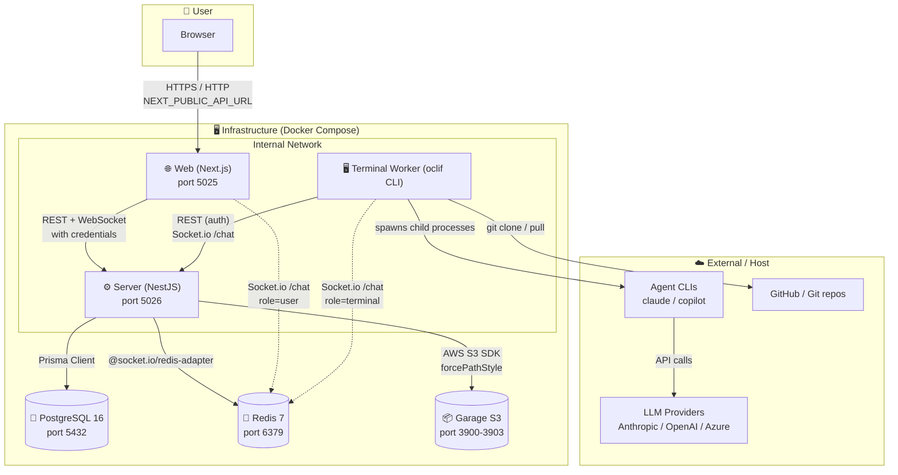
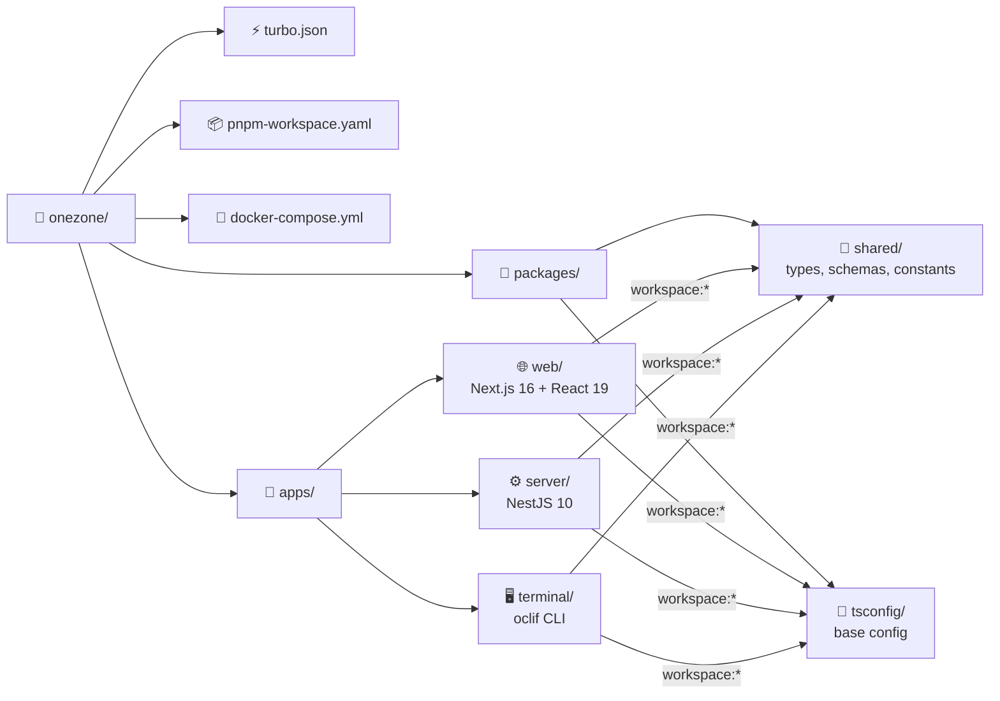
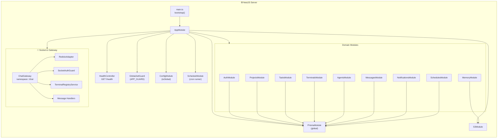
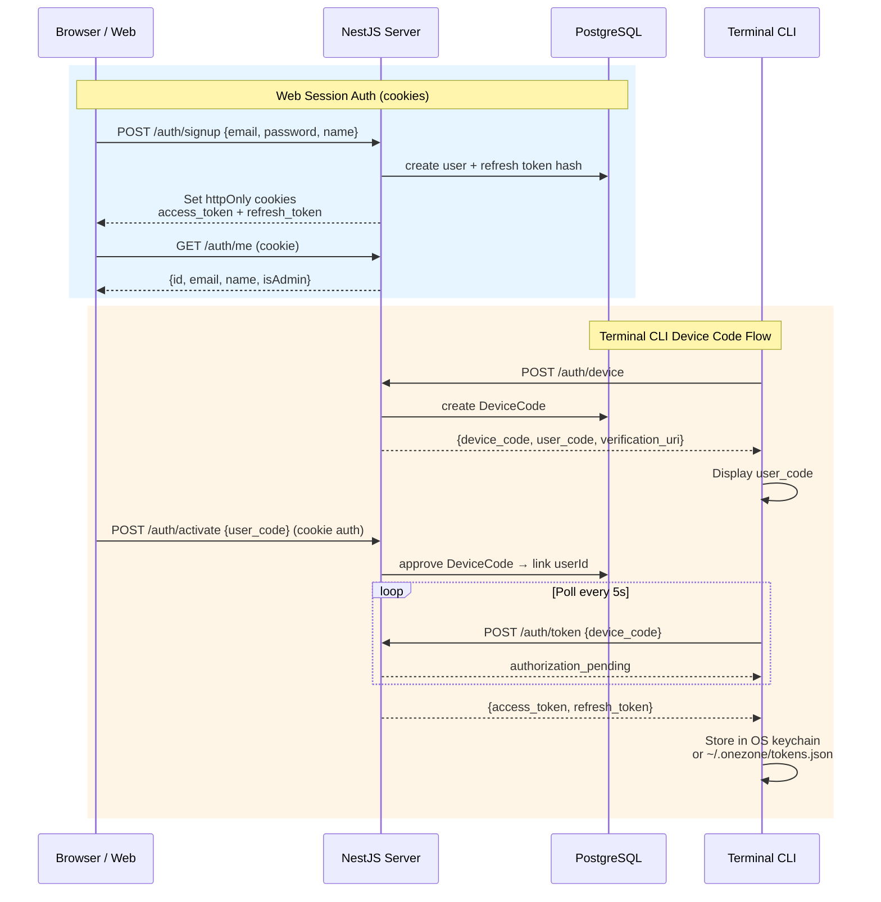
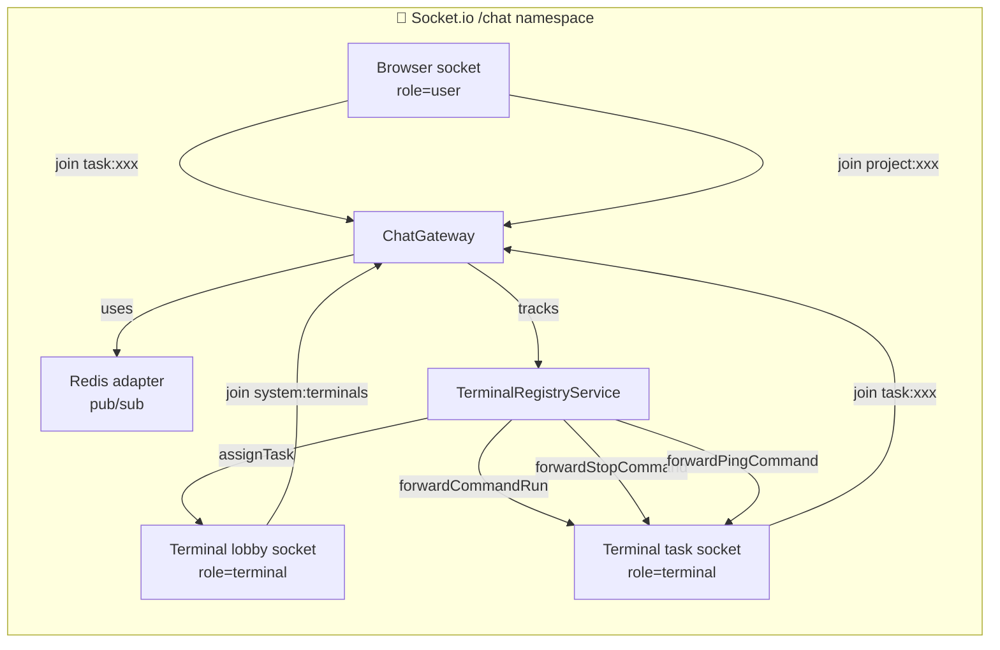
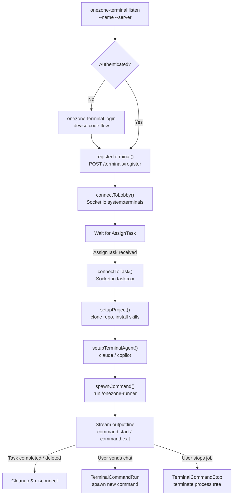
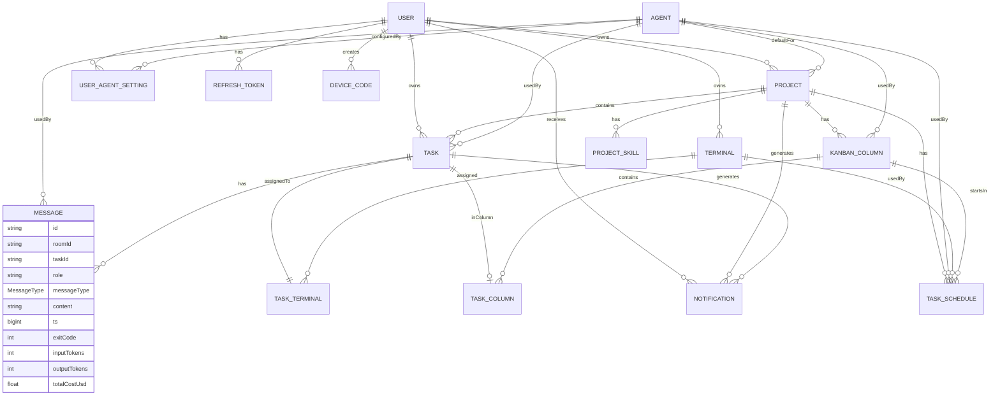
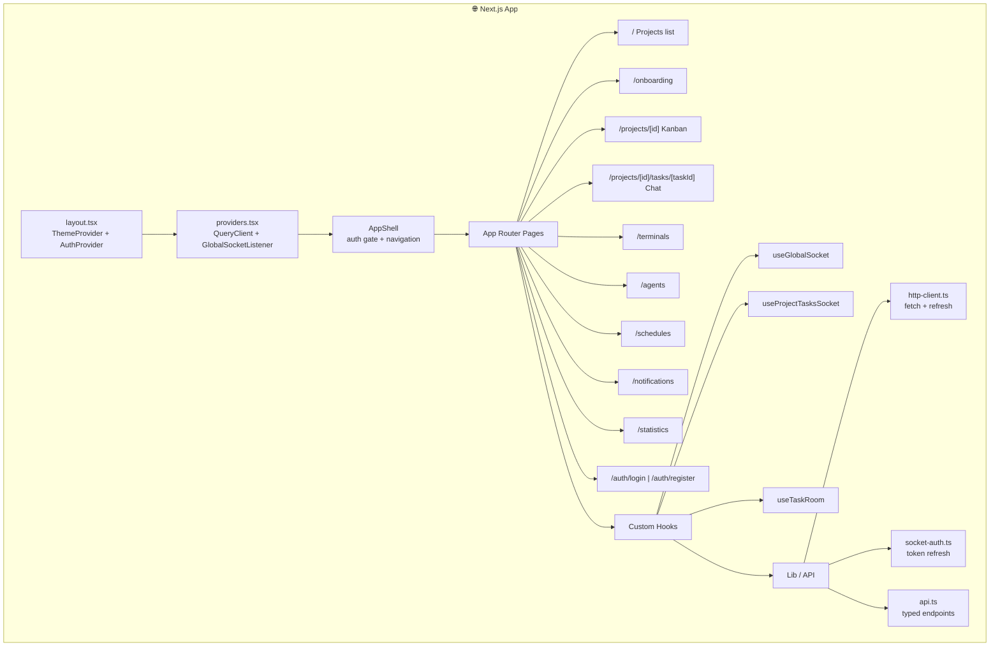
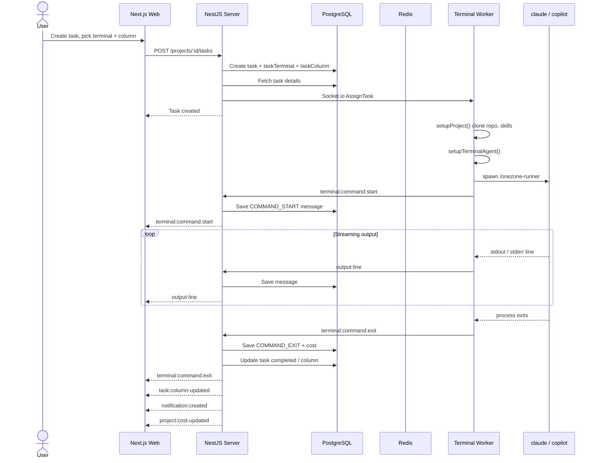

# Onezone Architecture

## System Overview

Onezone is a production-minded AI agent orchestration platform. It combines a Next.js dashboard, a NestJS API, a Socket.io real-time layer, and a terminal worker CLI so users can create projects, assign tasks, stream command output, monitor cost, and move work through kanban-style automation.

## Monorepo Layout

## Server Architecture (NestJS)

## Authentication Flows

## Real-Time Communication

### Socket Event Commands

| Direction | Event | Purpose |
|---|---|---|
| User → Server | `chat:message` | Send a chat/command to a task room |
| Server → Terminal | `terminal:command:run` | Forward saved user message to terminal |
| User → Server | `terminal:command:stop` | Request stop of a running job |
| Server → Terminal | `terminal:command:stop` | Forward stop to terminal |
| User → Server | `terminal:command:ping` | Send input to a running job stdin |
| Server → Terminal | `terminal:command:ping` | Forward ping to terminal |
| Terminal → Server | `output:line` | Stream stdout/stderr line |
| Terminal → Server | `terminal:command:start` | Notify command started |
| Terminal → Server | `terminal:command:exit` | Notify command exited |
| Server → All | `task:column-updated` | Kanban column change |
| Server → All | `notification:created` | New notification |
| Server → All | `project:cost-updated` | Cost stats update |
| Terminal → Server | `terminal:heartbeat` | Keep-alive ping |

## Terminal Worker Lifecycle

## Data Model (Prisma)

## Web App Structure

## Request Flow Example: Create Task → Execute

## Deployment Notes

- The server exposes REST and Socket.io on the same port. A reverse proxy must support WebSocket upgrades.
- `NEXT_PUBLIC_API_URL` is baked into the web Docker image at build time.
- The server applies Prisma migrations and seeds reference agents on container start.
- The terminal container installs `claude`, `copilot`, `uv`, and `rtk` at runtime via `docker-entrypoint.sh` so tools are persisted in volumes.
- Redis is used only for Socket.io horizontal scaling; the adapter is optional for a single server instance but required for multi-replica deployments.
